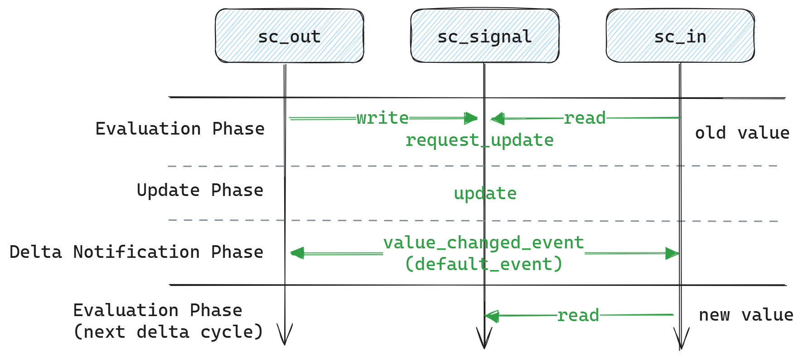

# Communication

## Port and Signal Communication



`sc_in`和`sc_out`继承自`sc_port`，`sc_signal`继承自`sc_prim_channel`。Evaluation Phase阶段调用`sc_in`的`write`函数，最终会调用到`sc_signal`的`request_update`函数。该函数向仿真器内核注册回调函数，并且在Update Phase阶段，由仿真器内核调用`update`回调函数，完成数据更新，并在Delta Notification Phase阶段触发`value_changed_event`，该event最终被传递到与该信号连接的端口上。

因此，在当前Evaluation阶段通过`read`获取的值是旧值， 下一个delta cycle的 Evaluation阶段之后才能获取新值。

```cpp:line-numbers
#include <systemc>
using namespace sc_core;
using namespace std;

struct MyMod : sc_module {
  SC_HAS_PROCESS(MyMod);
  sc_clock clk;
  sc_in<int> i;
  sc_out<int> o;
  MyMod(sc_module_name name)
      : sc_module(name), clk("clk", 1, SC_NS), i("input"), o("output") {
    SC_THREAD(write); sensitive << clk.posedge_event();
    SC_THREAD(read); sensitive << clk.posedge_event();
    SC_METHOD(f1); sensitive << i; dont_initialize();
    SC_METHOD(f2); sensitive << o; dont_initialize();
  }
  void write() { wait(); o.write(1); }
  void read() {
    while (true) {
      wait();
      cout << __LINE__ << ": " << i.read() << ", @" << sc_time_stamp() << endl;
      wait(SC_ZERO_TIME);
      cout << __LINE__ << ": " << i.read() << ", @" << sc_time_stamp() << endl;
    }
  }
  void f1() { cout << __LINE__ << ": " << i.read() << ", @" << sc_time_stamp() << endl; }
  void f2() { cout << __LINE__ << ": " << i.read() << ", @" << sc_time_stamp() << endl; }
};

int sc_main(int argc, char* argv[]) {
  MyMod m("m");
  sc_signal<int> s;
  m.i(s);
  m.o(s);
  sc_start(2, SC_NS);
  return 0;
}
```
第21行的打印显示，对于以同一个时钟为触发源的信号，当前上升沿的赋值需要在下一个上升沿才能获取新值，模拟了最基础的时序逻辑行为。第23、26和27行在当拍立即刷新，模拟的是组合逻辑行为。
```
21: 0, @0 s
26: 1, @0 s
27: 1, @0 s
23: 1, @0 s
21: 1, @1 ns
23: 1, @1 ns
```
