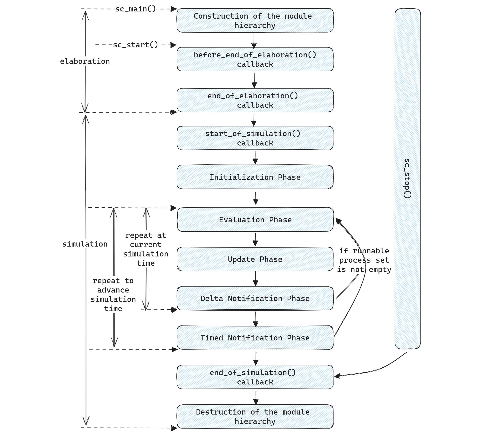

# Simulation Semantics

SC按照以下顺序执行仿真：

1.  Elaboration --- Construction of the module hierarchy
2.  Elaboration --- Callbacks to function `before_end_of_elaboration`
3.  Elaboration --- Callbacks to function `end_of_elaboration`
4.  Simulation --- Callbacks to function `start_of_simulation`
5.  Simulation --- Initialization phase
6.  Simulation --- Evaluation, update, delta notification, and timed notification phases (repeated)
7.  Simulation --- Callbacks to function `end_of_simulation`
8.  Simulation --- Destruction of the module hierarchy

`before_end_of_elaboration`, `end_of_elaboration`, `start_of_simulation`和`end_of_simulation`这四个回调函数在`sc_module`, `sc_port`, `sc_export`和`sc_prim_channel`中被定义为空的虚函数。用户可以根据需要重载。

几个基本概念：

* update request: 通过调用`sc_prim_channel`对象`request_update`或者`async_request_update`产生
* immediate notification: 通过调用`sc_event`对象的`notify`函数（不带入参）产生
* delta notification: 通过调用`sc_event`对象的`notify`函数（使用zero-valued time作为入参）产生
* timed notification: 通过调用`sc_event`对象的`notify`函数（使用non-zero-valued time作为入参）产生
* delta time-out: 通过调用`wait`或者`next_trigger`函数（使用zero-valued time作为入参）产生
* timed time-out: 通过调用`wait`或者`next_trigger`函数（使用non-zero-valued time作为入参）产生
* delta cycle: 由evaluation, update, 和delta notification组成。delta cylce并不推进仿真时间，除了调用`sc_stop`外，仿真器只能在delta cycle边界停止

## Elaboration

### Construction of the module hierarchy

* 例化`sc_module`, `sc_port`, `sc_export`, `sc_prim_channel`（含其派生类）组件
* 创建通过`SC_METHOD`, `SC_THREAD`, `SC_CTHREAD`宏，以及elaboration阶段调用`sc_spawn`生成的线程（此时并未开始执行）
* port和export端口连接
* 设置仿真时间精度（通过`sc_set_time_resolution`）

### `before_end_of_elaboration`

`before_end_of_elaboration`的作用是允许用户根据一些Construction of the module hierarchy阶段无法获取的全局信息修改模块的层次结构及其端口连接。

在`before_end_of_elaboration`和`end_of_elaboration`之间，仿真器内核会依次完成以下内容：

* 端口连接解析（端口最终需要连接到`sc_prim_channel`上，但是自下而上的层次化结构的端口连接过程中，子节点的端口连接到父节点的端口上，父节点的端口此时还未连接。因此需要等待整个SC模块层次结构稳定后做全局解析。解析完成后，`sc_port`的interface都指向了具体的`sc_prim_channel`）。
* 解析线程的`sc_port_base`和`sc_event_finder`类型的静态敏感条件（这两类静态敏感条件本质是承载在`sc_prim_channel`上，因此需要在端口解析完成后进行）

### `end_of_elaboration`

进入回调函数`end_of_elaboration`之后，用户无法再修改模块的层次结构及其端口连接。但该回调函数内可以继续创建新的线程（spawned和unspawned都可以），由于此阶段端口连接解析全部完成，因此可以直接获取到承载在`sc_prim_channel`上的静态敏感条 件。

## Simulation Scheduling Algorithm

需要用到四个集合：

- *runnable processes集合*
- *update requests集合*
- *delta notifications and time-outs集合*
- *timed notifications and time-outs集合*

### `start_of_simulation`

仿真开始前的回调函数，可以继续创建线程，但是只能创建spawned的线程。

### Initialization Phase

顺序执行以下步骤：

1. 执行Update Phase
2. 将在elaboration阶段创建的除`dont_initialize`和clocked thread processes之外的所有线程添加到*runnable processes集合*
3. 执行Delta Notification Phase

### Evaluation Phase

执行*runnable processes集合*中的线程，每次只能执行一个线程，每个线程执行完毕（不一定代表函数返回，指的是控制权交还给仿真器内核，例如调用`wait`函数）后将其从*runnable processes集合*中移除，然后执行集合内的下一个线程。集合内各线程的先后顺序用户不可控。

线程执行过程中可以通过`sc_spawn`创建新的线程，该线程会被添加到*runnable processes集合*（除非设置了`sc_spawn_options::dont_initialize`）。

可以通过`sc_process_handle`添加新的线程到*runnable processes集合*，或者将线程从该集合中移除。

线程执行过程中可以产生immediate notification，当前所有以此event为敏感条件的线程都会被添加到*runnable processes集合*中，并将在当前Evaluation Phase被执行。即，immediate notification触发了新的runnable processe。但是，immediate notification产生的event不能触发当前正在被执行的线程本身。

线程执行过程中可以产生update request，并添加到*update requests集合*。

线程执行过程中可以产生delta notifications和delta time-outs，并添加到*delta notifications and time-outs集合*。

线程执行过程中可以产生timed notifications和timed time-outs，并添加到*timed notifications and time-outs集合*。

直到*runnable processes集合*中的线程全部执行完毕（含当前phase新添加的runnable processes），执行下一个Update Phase。

### Update Phase

执行*update requests集合*中的`update`回调函数，每个被处理的request将从集合中移除。

Update Phase执行完毕后，执行Delta Notification Phase（Initialization Phase中执行的Update Phase除外）。

### Delta Notification Phase

对于*delta notifications and time-outs集合*中的每一个event或者time-out，将所有对其敏感的线程添加到*runnable processes集合*中，并清空*delta notifications and time-outs集合*。

如果此时*runnable processes集合*非空，跳转到Evaluation Phase；否则，执行Timed Notification Phase。

### Timed Notification Phase

将仿真时间往前推进到*timed notifications and time-outs集合*中最近的时间点，然后将对该时间点的timed notification或者timed time-out敏感的所有线程添加到*runnable processes集合*中，并清空对应时间点的*timed notifications and time-outs集合*。

如果此时*runnable processes集合*非空，跳转到Evaluation Phase；否则，说明仿真结束，退出仿真。

### `start_of_simulation`

仿真结束后的回调函数。

### Destruction of the module hierarchy

析构所有组件。
